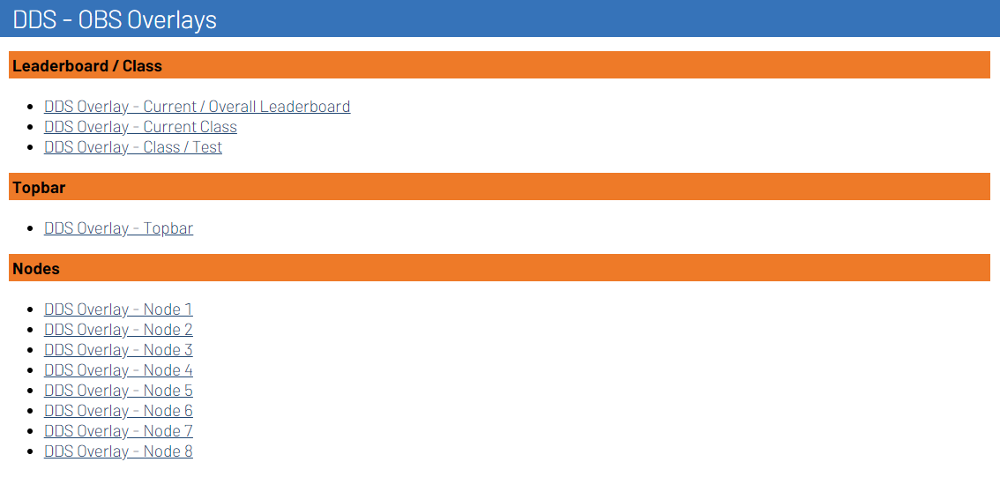

I'm happy to announce the release of v1.1.0 of the Stream Overlays! This release includes a lot of new features and a new documentation site. In this blog post, I will highlight the most important changes.

<!-- more -->

## Documentation site

The Stream Overlays plugin now has a dedicated documentation site. This site contains all the information you need to get started with the RotorHazard plugin, including installation instructions, configuration options, and an overview of all available overlays.

## Overlay for leaderboard rankings

!!! note "Experimental feature"
    The leaderboard overlays are still experimental and may not work as expected. If you encounter any issues, please report them in the [issue tracker][issues].

The [Dutch Drone Squad](../../overlays/dds.md) theme now includes overlays for the leaderboard. This allows you to show the current ranking of the pilots for the current class in your stream. The leaderboard is updated in real-time and shows different data depending on the race format.

{ style="border-radius: 5px;" }

## Panels on Stream Displays page

The plugin now generates panels on the Stream Displays page in RotorHazard. These panels contain the overlay URLs for each overlay, making it easier to get the right link for your stream.

{ style="border-radius: 5px;" }

## Install script

The installation script has been updated to support **development** and **release** versions of the plugin. You can run the script with the following command:

```bash
sh -c "$(curl -fsSL https://short.dutchdronesquad.nl/install-overlays-plugin)"
```

---

I hope you enjoy this release! If you have any questions or feedback, feel free to reach out to me on Discord (misternicolaz) or [GitHub](https://github.com/klaasnicolaas).

Happy flying! 🚀

./Klaas

<!-- Links -->
[issues]: https://github.com/dutchdronesquad/rh-stream-overlays/issues
