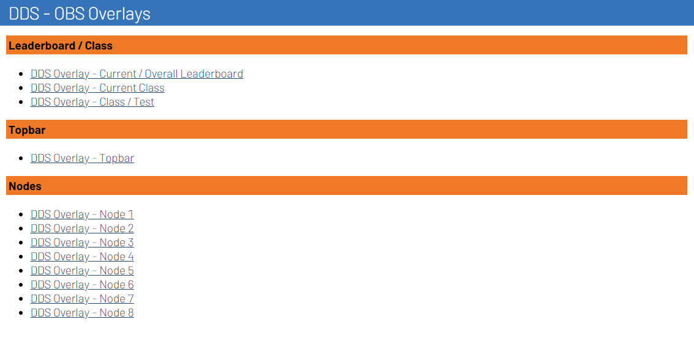

# Installation

Install the Stream Overlays plugin using one of two methods: the RotorHazard web interface (recommended) or a command-line script.

---

## Method 1: Community Plugins (Recommended)

The easiest way to install Stream Overlays is through RotorHazard's built-in plugin manager.

### Prerequisites

- [x] RotorHazard 4.0.x or newer
- [x] Internet connection on the RotorHazard device
- [x] Admin access to RotorHazard web interface

### Installation Steps

1. **Open RotorHazard** web interface in your browser
2. Navigate to **Settings** → **Plugins** tab
3. Click **Browse Community Plugins** (requires internet connection)
4. Search for **Stream Overlays** in the plugin list
5. Click the **Install** button next to the plugin
6. Wait for installation to complete (progress bar will appear)
7. **Restart RotorHazard** to activate the plugin

!!! success "Installation Complete"
    After restarting, you should see Stream Overlays listed in the **Plugins** tab. Navigate to the **Streams** page to access overlay URLs.

### Verification

To verify the plugin is working:

1. Go to the **Streams** page in RotorHazard
2. Look for Stream Overlays panels (Apex, DDS, LCDR)
3. Click any overlay link to test it in your browser

---

## Method 2: Install Script (Advanced)

For users comfortable with the command line or deploying to headless systems.

### Prerequisites

- [x] SSH/terminal access to the RotorHazard device
- [x] `curl` installed (usually pre-installed on Linux/macOS)
- [x] Internet connection

### Installation Steps

1. **Connect to your RotorHazard device** via SSH or open a terminal

2. **Run the installation script:**

    ```bash
    bash -c "$(curl -fsSL https://short.dutchdronesquad.nl/install-overlays-plugin)"
    ```

3. **Choose a version:**

    === "Stable (Recommended)"

        - Select **stable** when prompted
        - The script shows the last 5 releases from GitHub
        - Choose your desired version (usually the latest)
        - Press ++enter++ to confirm

    === "Development"

        - Select **development** when prompted
        - Installs the latest `main` branch code
        - May include unreleased features but less stable
        - Use for testing or contributing

4. **Update existing installation** (if applicable):

    - If the plugin is already installed, you'll be asked to update
    - Choose **y (yes)** to overwrite with the new version
    - Choose **n (no)** to exit without changes

5. **Restart RotorHazard:**

    ```bash
    sudo systemctl restart rotorhazard
    ```

    Or manually stop/start RotorHazard if not using systemd.

!!! note "What the Script Does"
    The install script automates:

    - Fetching release data from GitHub
    - Downloading the plugin files
    - Extracting to RotorHazard's `plugins/` directory
    - Cleaning up temporary files
    - Verifying installation integrity

### Troubleshooting Script Installation

**Script fails to download:**

Check internet connectivity and GitHub availability:

```bash
curl -I https://api.github.com
```

**Permission errors:**

Run the script with appropriate permissions or use `sudo`:

```bash
sudo bash -c "$(curl -fsSL https://short.dutchdronesquad.nl/install-overlays-plugin)"
```

**Plugin directory not found:**

Ensure RotorHazard is installed in the default location. The script looks for:

- `/home/pi/RotorHazard/` (Raspberry Pi)
- `~/RotorHazard/` (generic Linux)

---

## Post-Installation

After installing the plugin, configure your overlays:

<div class="next-steps-grid">
  <div class="next-step-card">
    <span class="next-step-icon">🚀</span>
    <strong>Quick Start</strong>
    <p>Follow the <a href="/getting-started">Quick Start guide</a> for a 5-minute setup walkthrough</p>
  </div>
  <div class="next-step-card">
    <span class="next-step-icon">🖥️</span>
    <strong>OBS Setup</strong>
    <p>Configure <a href="/getting-started/obs-setup">browser sources</a> and optimize settings</p>
  </div>
  <div class="next-step-card">
    <span class="next-step-icon">🎨</span>
    <strong>Browse Themes</strong>
    <p>Explore the <a href="/overlays">overlay catalog</a> with all available themes</p>
  </div>
</div>

---

## Updating the Plugin

### Via Community Plugins

1. Go to **Settings** → **Plugins** → **Browse Community Plugins**
2. Find **Stream Overlays**
3. If an update is available, click **Update**
4. Restart RotorHazard

### Via Install Script

Simply re-run the installation script and choose **y (yes)** to overwrite:

```bash
bash -c "$(curl -fsSL https://short.dutchdronesquad.nl/install-overlays-plugin)"
```

---

## Uninstalling

### Via RotorHazard Interface

1. Go to **Settings** → **Plugins**
2. Find **Stream Overlays** in the installed plugins list
3. Click **Uninstall**
4. Restart RotorHazard

### Manual Removal

Delete the plugin directory:

```bash
rm -rf ~/RotorHazard/src/server/plugins/stream_overlays
```

Then restart RotorHazard.

---

## Stream Displays (4.2.x+)

!!! info "RotorHazard 4.2.x+ Feature"
    Stream Overlays automatically adds panels to the **Streams** page for easy URL access.

### Finding Overlay URLs

Instead of manually constructing URLs, use the built-in Stream Displays:

1. Navigate to **Streams** page in RotorHazard
2. Scroll to the **Stream Overlays** section
3. Click any overlay link to preview it
4. Copy the URL from your browser's address bar
5. Paste into OBS browser source

{ style="border-radius: 8px; border: 1px solid var(--border-color); margin-top: 1rem;" }

This feature simplifies setup by providing clickable links for all available overlays organized by theme.

---

## Need Help?

- **[Quick Start Guide](index.md)** — Complete setup walkthrough
- **[FAQ & Troubleshooting](../faq/index.md)** — Common installation issues
- **[GitHub Discussions](https://github.com/dutchdronesquad/rh-stream-overlays/discussions)** — Ask the community
