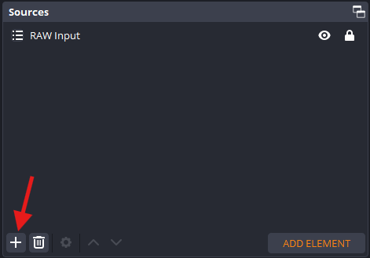
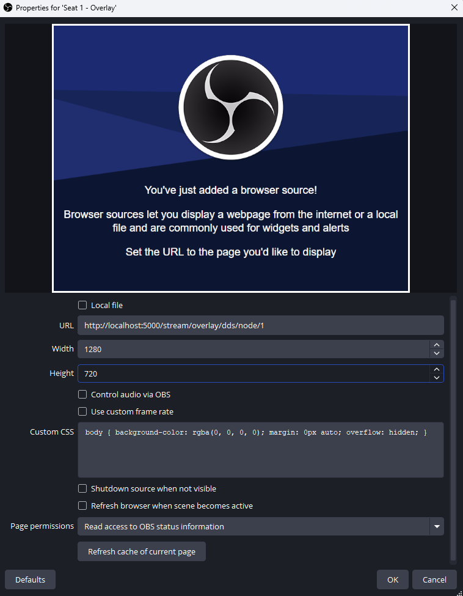

# OBS Setup Guide

Learn how to add Stream Overlays to OBS Studio using browser sources and optimize performance for smooth streaming.

---

## Adding a Browser Source

Follow these steps to add an overlay to your OBS scene:

### 1. Create the Source

In your OBS scene, click the **+** button in the Sources panel and select **Browser**.

{ style="border-radius: 8px; border: 1px solid var(--border-color);" }

### 2. Name Your Source

Give it a descriptive name like:

- `Apex - Node 1`
- `DDS - Topbar`
- `LCDR - Node 2`

This helps you organize scenes when you have multiple overlays.

### 3. Configure Browser Settings

Enter these settings in the browser source properties:

| Setting | Value | Notes |
|---------|-------|-------|
| **URL** | `http://[RH-IP]:5000/stream/overlay/[theme]/[type]` | Get URLs from [Overlay Overview](../overlays/index.md) |
| **Width** | `1920` | Match your OBS canvas width |
| **Height** | `1080` | Use `100` for topbars, or match canvas height for full-screen overlays |
| **FPS** | `30` or `60` | Higher = smoother, but more CPU usage |
| **Custom CSS** | Keep the OBS default CSS | The default transparent background CSS keeps overlay sources transparent |

{ style="border-radius: 8px; border: 1px solid var(--border-color);" }

### 4. Enable Recommended Options

Check these boxes for optimal performance:

- [x] **Shutdown source when not visible** — Saves CPU when overlay is hidden
- [x] **Refresh browser when scene becomes active** — Ensures fresh data on scene switch

!!! tip "Canvas Resolution"
    Match full-screen overlay sources to your OBS **Base Canvas** resolution:

    - 1080p → 1920×1080
    - 720p → 1280×720
    - 4K → 3840×2160

    Topbars are the exception: use a wide, low browser source such as 1920×100.

---

## Performance Optimization

### Hardware Acceleration

Enable GPU acceleration in OBS for better browser source performance:

1. Go to **File** → **Settings** → **Advanced**
2. Set **Video Renderer** to **Direct3D 11** (Windows) or **OpenGL** (macOS/Linux)
3. Restart OBS

### Browser Source FPS

Lower FPS for less critical overlays to save resources:

- **Topbars/Timers:** 60 FPS (smooth animations)
- **Node overlays:** 30 FPS (adequate for lap updates)
- **Static heat boards:** 15 FPS (minimal motion)

Right-click the source → **Properties** → **FPS** to adjust.

### Scene Organization

Create dedicated scenes for each overlay type to avoid running multiple browser sources simultaneously. See [OBS Scene Layouts](../production/obs-scene-layouts.md) for complete production recipes, including race matrix, TrackDraw map, overview, heat board, and results scenes.

---

## Advanced Tips

### Projecting Overlays to External Display

For confidence monitors or venue screens:

1. Open the overlay URL in a browser (Chrome recommended)
2. Press ++f11++ for fullscreen
3. Drag window to target display

Or use OBS's **Fullscreen Projector** feature (right-click scene → **Fullscreen Projector**).

### Custom Browser Dock

Add overlays as a browser dock for live monitoring:

1. **View** → **Docks** → **Custom Browser Docks**
2. Enter the overlay URL
3. Name it (e.g., "Live Topbar Preview")

This gives you a real-time view without switching scenes.

### Chroma Key Alternative

If you need to composite overlays differently, use **Color Key** filter instead of chroma:

1. Add the browser source
2. Right-click → **Filters** → **+** → **Color Key**
3. Set **Key Color Type** to **Custom**
4. Pick the background color (usually black)

---

## Recommended OBS Settings

For best results with Stream Overlays:

=== "1080p 60fps"

    ```yaml
    Output:
      Video Bitrate: 6000 Kbps
      Encoder: x264 or NVENC H.264
      Preset: Medium (CPU) / Quality (GPU)

    Video:
      Base Canvas: 1920×1080
      Output Resolution: 1920×1080
      FPS: 60
    ```

=== "720p 30fps"

    ```yaml
    Output:
      Video Bitrate: 2500 Kbps
      Encoder: x264 or NVENC H.264
      Preset: Fast (CPU) / Quality (GPU)

    Video:
      Base Canvas: 1280×720
      Output Resolution: 1280×720
      FPS: 30
    ```

---

## Need Help?

Having issues with OBS? Check the **[OBS Setup FAQ](../faq/obs-setup.md)** for troubleshooting tips.

**Other resources:**

- **[Overlay Overview](../overlays/index.md)** — Browse themes, overlay types, and URL patterns
- **[Advanced Guides](../advanced/index.md)** — Build complete OBS scene collections
- **[Getting Started Guide](index.md)** — Complete setup walkthrough
- **[GitHub Discussions](https://github.com/dutchdronesquad/rh-stream-overlays/discussions)** — Ask questions and get help
