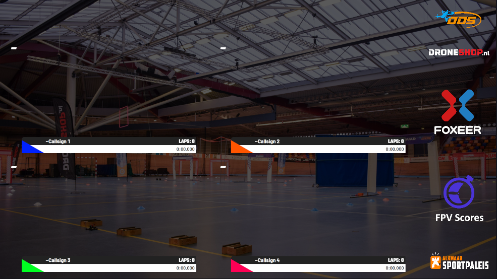

# Stream Overlays plugin for RotorHazard

This plugin adds new designed stream overlays to RotorHazard, which can be used in OBS (Open Broadcaster Software). A showcase of all overlays can be [found here](overlays/index.md).

Do you have any wishes for a new overlay? Then leave your ideas, sketches or mood board in the [discussions tab](https://github.com/dutchdronesquad/rh-stream-overlays/discussions) and maybe, we can develop it into something beautiful 😍

{ style="width: 100%; border-radius: 5px;" }

## Overview

- [Installation](installation/index.md): How to install the plugin
- [Overlays](overlays/index.md): Showcase of all available overlays
- [Blog](blog/index.md): Blog posts about the plugin

## Key features

- **Responsive**: The overlays are designed to be responsive on all screen sizes
- **Easy to use**: Just add the URL to your OBS and you're ready to go
- **Open source**: The plugin is open source and can be modified to your needs

## Get Started

Ready to dive in? Check out our [Installation](./installation/index.md) guide or jump right into the [Overlays](./overlays/index.md) showcase.