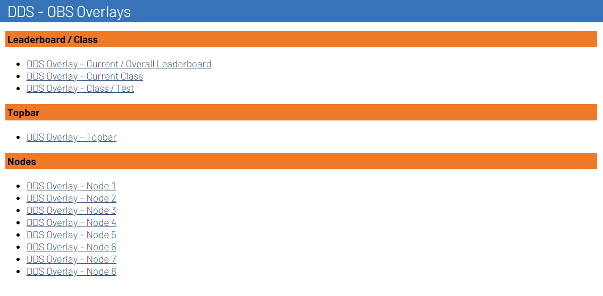

# Installation

Follow the steps below to install the Stream Overlays plugin for RotorHazard.

## RotorHazard

1. Install the **Stream Overlays** RotorHazard plugin, by running the following command in your terminal at the device where RotorHazard is installed:
``` bash
bash -c "$(curl -fsSL https://short.dutchdronesquad.nl/install-overlays-plugin)"
```

2. You'll be prompted to choose between **stable** or **development**:
    - **stable**: Choose this option if you want to install a stable release.
        - The script will fetch the last 5 stable releases from GitHub.
        - Choose the version you want to install and press enter.
    - **development**: Choose this option if you want to install the latest development version.
        - The script will fetch the main branch from GitHub.
5. If the plugin is already in RotorHazard, you'll be prompted to update it.
    - Choose **y (yes)** to update the plugin.
    - Choose **n (no)** to exit the script.
6. When the installation is finished, restart RotorHazard.

!!! note
    This script automates the installation or update of the "Stream Overlays" plugin for RotorHazard. It fetches the last 5 stable release or development branch from GitHub based on your choice, download the plugin and ensures cleanup of temporary data, simplifying the plugin installation process.

## Stream displays

!!! note
    This feature is only available in RotorHazard v4.2.x and later.

To make it easier to find the right URLs for all the (themed) overlays, the plugin will automatically create panels on the **Streams** page in RotorHazard. Just click on the link of the overlay you want to use, and it will open in a new tab. Copy the URL from the address bar and use it in your streaming software (OBS).

{ style="border-radius: 5px;" }
