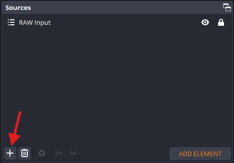
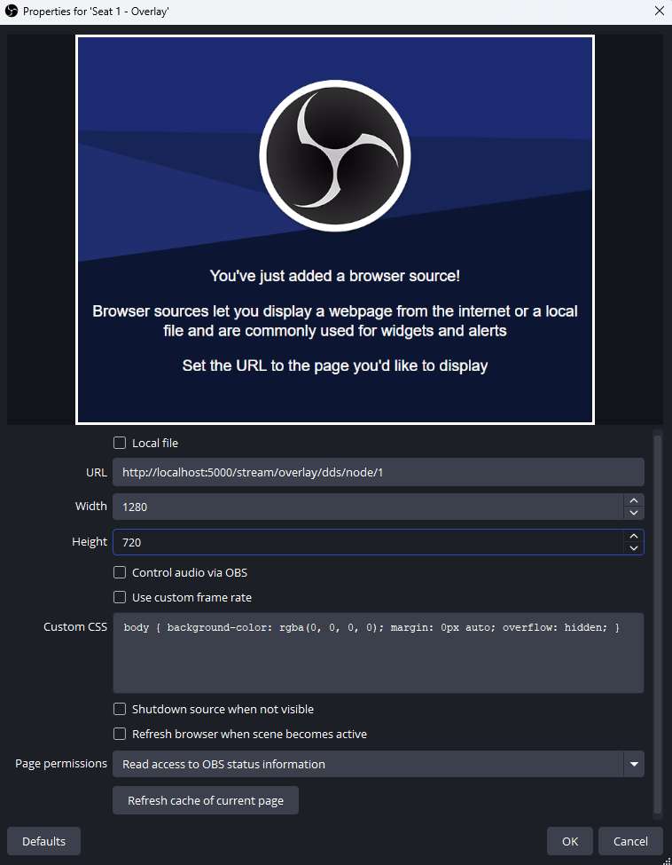

# OBS Setup

To use the overlays in OBS, you need to add a new source to your scene. This source will be a **Browser** source, which will display the overlay in your stream.

1. Add a new source to your scene, with the **+** button
    { style="border-radius: 5px;" }
2. Select **Browser** as source type
3. Give the source a name (e.g. `Node 1 - Overlay`)
4. Enter the URL of the overlay you want to use (see the [showcase](../overlays/index.md) for the URL's)
5. Set the width and height to the resolution of your stream (e.g. 1280 x 720). 
6. Keep the Custom CSS as it is, this will remove the grey background of the overlay
    { style="border-radius: 5px;" }
7. Select **OK** to add the overlay to your scene