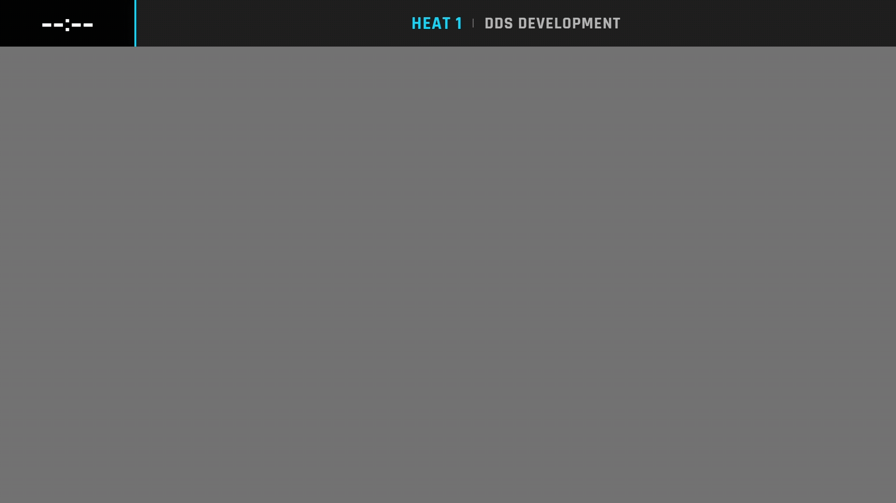

# Apex

Apex is a high-contrast, glassy theme inspired by esports broadcasts. It focuses on bold typography, a floating position badge, and a compact lap history so single-pilot cameras can look premium without complicated scene setup. Apex works particularly well for streams where each pilot gets their own scene and you want the overlay to feel like part of the graphics package rather than an afterthought.

## Theme highlights

- **Floating rank badge**: A standalone position banner anchors to the top-left corner and scales with your canvas. The ordinal suffix mirrors the same glow so the badge stays readable on ultrawide crops.
- **Glassmorphism cards**: Lap data and totals live inside frosted cards with accent lighting that inherits each pilot color. This creates depth without adding heavy gradients to your OBS layout.
- **Animated lap feed**: New laps slide in with motion + highlighting, and fastest laps stay pinned with color cues. The animation is subtle enough for long races but gives the audience clear feedback.
- **Minimal setup**: With only two overlay URLs (topbar + node), Apex is a quick drop-in for events that need a cohesive look without configuring leaderboards or extra scenes.

!!! note "Available overlays"
    Apex currently ships with a **node overlay**, **topbar**, and a matching **upcoming heat** board. It also supports the TrackDraw map and overview through the [TrackDraw integration](../integrations/trackdraw/index.md). Leaderboard layouts are still on the backlog.

## Topbar

The Apex topbar mirrors broadcast tickers, showing the active heat, event name, and timer information inside a single metallic strip.

URL to use:

```bash
RH-IP:5000/stream/overlay/apex/topbar
```



## Upcoming heat

Shows the current active heat with pilot lineup and channel assignments. The overlay uses a glass panel with backdrop blur that works on any background.

- Displays heat name, class, round, and format information
- Seat cards show pilot callsign, name, and frequency/channel
- Automatically scales to fit 720p/1080p canvases
- Grid layout adapts from 1 to 4 columns depending on seat count

URL to use:

```bash
RH-IP:5000/stream/overlay/apex/heat/upcoming
```


!!! note "Background transparency"
    The background visible in the preview GIF is not part of the overlay. You can configure your own background color or image in OBS to match your stream design.

## Node

The node overlay combines the floating position badge, pilot info card, and animated lap list. The accent bar at the base pulses with the pilot color to keep OBS scenes lively even during longer heats. Replace `[NUMBER]` with the node id you want to show.

URL to use:

```bash
RH-IP:5000/stream/overlay/apex/node/[NUMBER]
```


## TrackDraw integration

Apex can style the TrackDraw map and overview overlays. Pilot badges use the APEX glassmorphism style with a dark card and full pilot-color border stroke.

### Live Race Map

Use the TrackDraw map when you want a dedicated track view or a compact map overlay styled with Apex pilot badges.

```bash
RH-IP:5000/stream/overlay/apex/trackdraw/map
```

<!-- TODO: Add Apex TrackDraw map GIF preview: ../assets/img/overlays/apex/apex-trackdraw-map.gif -->

### Overview

Use the TrackDraw overview for commentator scenes with a map, leader callout, and pilot list.

```bash
RH-IP:5000/stream/overlay/apex/trackdraw/overview
```

<!-- TODO: Add Apex TrackDraw overview GIF preview: ../assets/img/overlays/apex/apex-trackdraw-overview.gif -->

See the [TrackDraw integration](../integrations/trackdraw/index.md) docs for setup, OBS settings, and production guidance.
