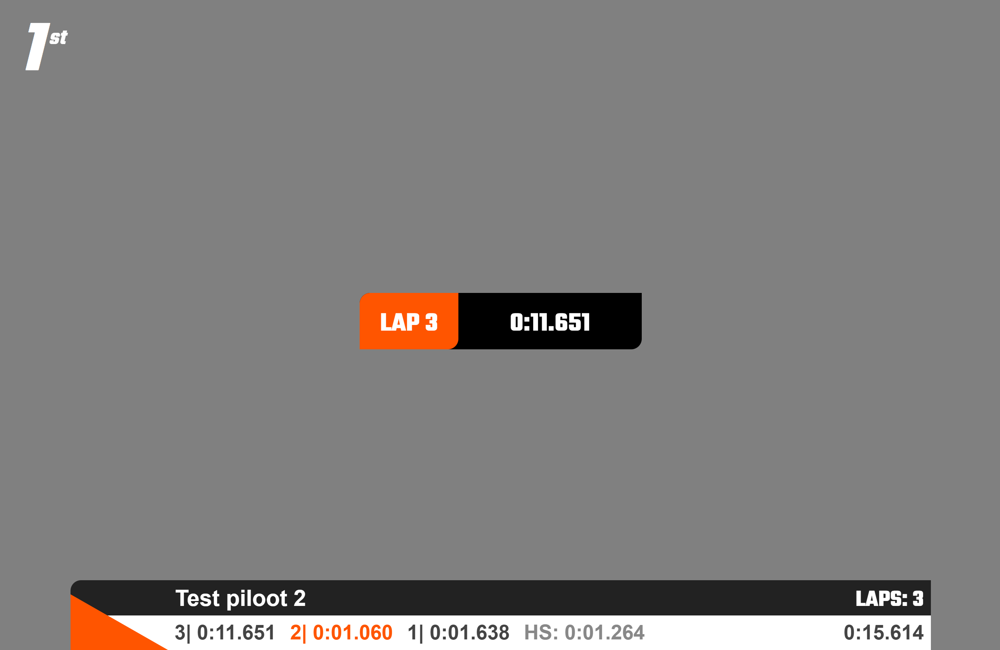
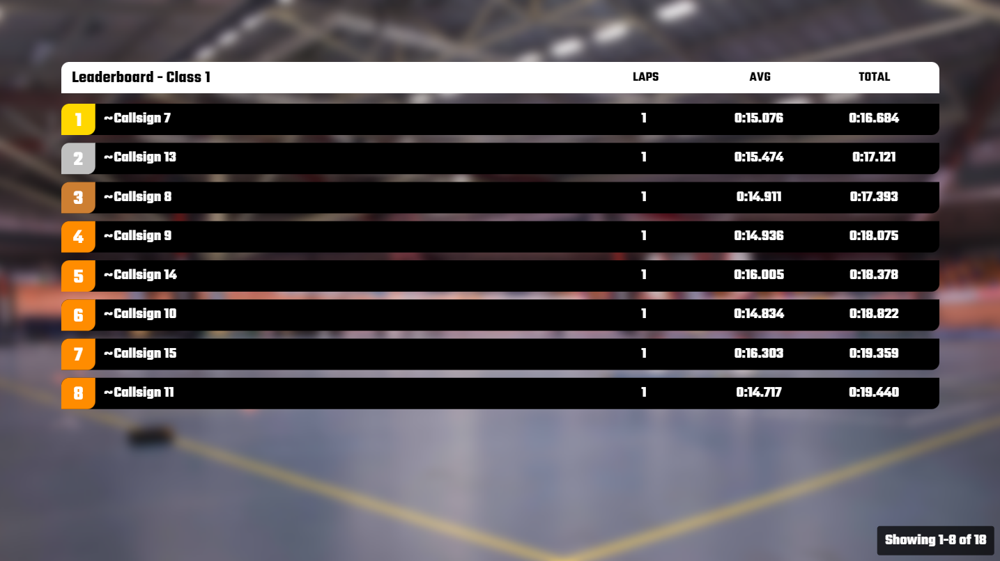
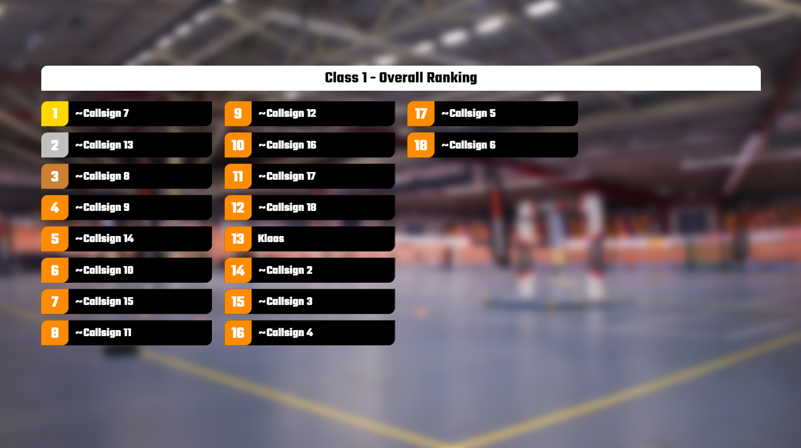

# Dutch Drone Squad

This overlay is designed by the <a href="https://dutchdronesquad.nl" target="_blank">Dutch Drone Squad</a> and consists of a top bar, node overlay and leaderboards for class and overall.

## Topbar

The title in the top bar consists of a heat name and event name which dynamically adapts to what is set in RotorHazard.

URL to use:

```bash
RH-IP:5000/stream/overlay/dds/topbar
```


## Node

The node overlay shows the pilot name, lap time, total time and lap number. The color of the node changes based on what is set in RotorHazard for each pilot. Replace `[NUMBER]` with the node id you want to show.

URL to use:

```bash
RH-IP:5000/stream/overlay/dds/node/[NUMBER]
```

[](https://www.youtube.com/watch?v=ZpV0veJErvE)
_Click on the image to watch a video of the overlay in action_

## Leaderboard 

### Class Ranking

The leaderboard class overlay displays the rankings of pilots within a specific class, including some race data. Pilots are presented in groups of eight, with a new set of pilots shown every 10 seconds.

The table adapts to the type of the race format: **standard**, **fastest lap** or (top 3) **consecutive**. Replace `[CLASS ID]` with the class id you want to show or use `0` for the current class.

!!! warning
    Currently you only see data if you use **Ranking: From Race Format**

URL to use:

```bash
RH-IP:5000/stream/overlay/dds/leaderboard/[CLASS ID]/class
```


[](https://youtu.be/xqIuBfLjtJE)
_Click on the image to watch a video of the overlay in action_

### Overall Ranking

The leaderboard overall overlay displays the overall rankings of up to 32 pilots. Replace `[CLASS ID]` with the class id you want to show or use `0` for the current class.

!!! warning
    Currently you only see data if you use **Ranking: From Race Format**

URL to use:

```bash
RH-IP:5000/stream/overlay/dds/leaderboard/[CLASS ID]/overall
```

[](https://youtu.be/kTtoHACqsg0)
_Click on the image to watch a video of the overlay in action_
