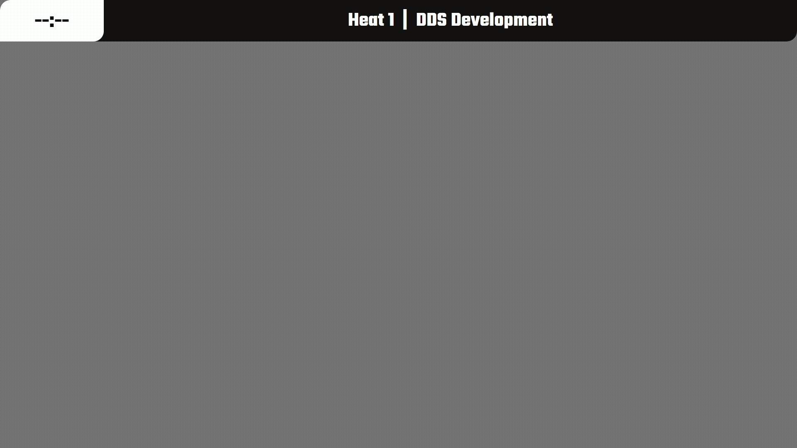
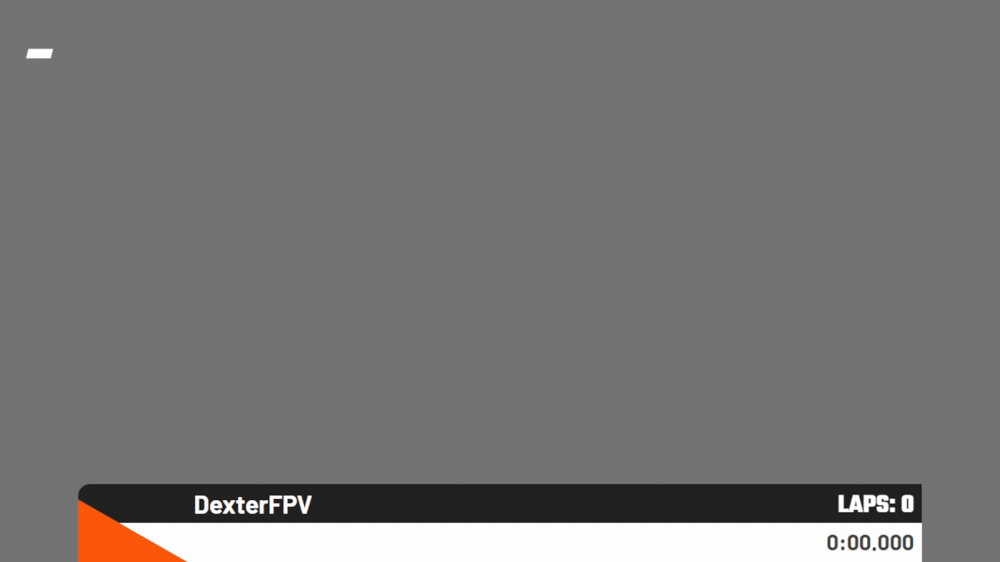
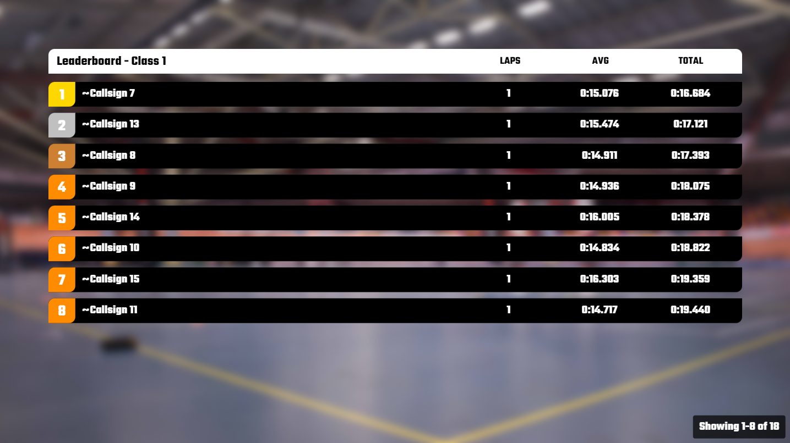
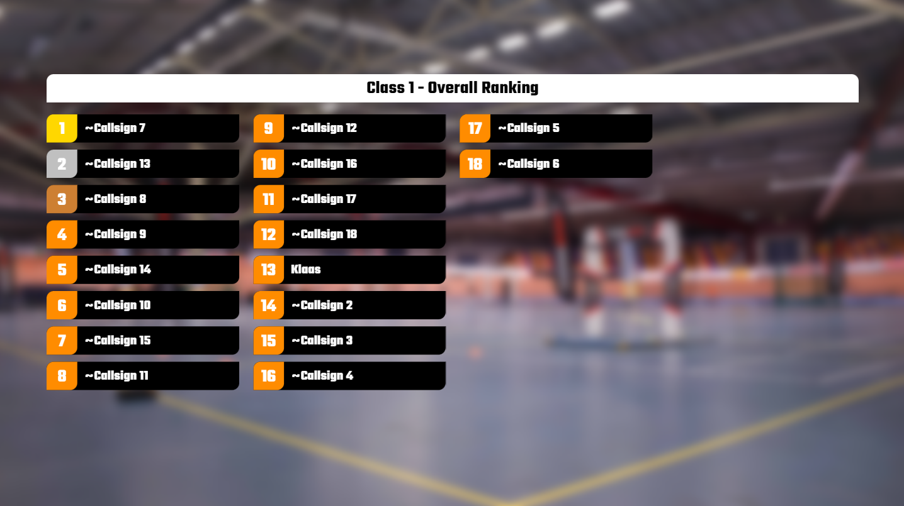

# Dutch Drone Squad

This theme is designed by the <a href="https://dutchdronesquad.nl" target="_blank">Dutch Drone Squad</a> and consists of a top bar, node overlay and leaderboards for class and overall.

## Theme highlights

- **Full overlay suite**: DDS ships with topbar, node, class leaderboard, and overall leaderboard so you can cover every scene of a stream with a single theme.
- **Heat-aware UI**: The topbar automatically swaps the heat and event titles based on RotorHazard data, making schedule changes painless.
- **Color-driven pilots**: Node overlays inherit the pilot color from RotorHazard so team branding remains consistent across shots.
- **Format-ready leaderboards**: Class/overall tables adapt to standard, fastest-lap, or consecutive formats without extra setup, and automatically paginate longer lists.

## Topbar

The title in the top bar consists of a heat name and event name which dynamically adapts to what is set in RotorHazard. The ticker has been tuned for 16:9 streams, but it scales nicely down to 720p OBS scenes.

URL to use:

```bash
RH-IP:5000/stream/overlay/dds/topbar
```



## Upcoming heat

Shows the current active heat with pilot lineup and channel assignments. Perfect for pre-heat announcements or during breaks between races.

- Displays heat name and event information
- Seat cards show pilot callsign and frequency/channel
- Automatically scales to fit 720p/1080p canvases
- Grid layout adapts based on seat count

URL to use:

```bash
RH-IP:5000/stream/overlay/dds/heat/upcoming
```


!!! note "Background transparency"
    The background visible in the preview GIF is not part of the overlay. You can configure your own background color or image in OBS to match your stream design.

## Node

The node overlay shows the pilot name, lap time, total time and lap number. The color of the node changes based on what is set in RotorHazard for each pilot. Replace `[NUMBER]` with the node id you want to show. Use it in a solo scene or stack multiple nodes in a grid for “all pilots” views.

URL to use:

```bash
RH-IP:5000/stream/overlay/dds/node/[NUMBER]
```



## Leaderboard

### Class ranking

The leaderboard class overlay displays the rankings of pilots within a specific class, including race data such as laps completed, fastest lap, and total time. Pilots are presented in groups of eight, with a new set of pilots shown every 10 seconds to allow full-class coverage without clutter.

The table adapts to the type of the race format: **standard**, **fastest lap** or (top 3) **consecutive**. Replace `[CLASS ID]` with the class id you want to show or use `0` for the current class.

!!! warning
    Currently you only see data if you use **Ranking: From Race Format** in RotorHazard.

URL to use:

```bash
RH-IP:5000/stream/overlay/dds/leaderboard/[CLASS ID]/class
```


[](https://youtu.be/xqIuBfLjtJE)
_Click on the image to watch a video of the overlay in action_

### Overall ranking

The leaderboard overall overlay displays the overall rankings of up to 32 pilots. Replace `[CLASS ID]` with the class id you want to show or use `0` for the current class.

!!! warning
    Currently you only see data if you use **Ranking: From Race Format** in RotorHazard.

URL to use:

```bash
RH-IP:5000/stream/overlay/dds/leaderboard/[CLASS ID]/overall
```

[](https://youtu.be/kTtoHACqsg0)
_Click on the image to watch a video of the overlay in action_
