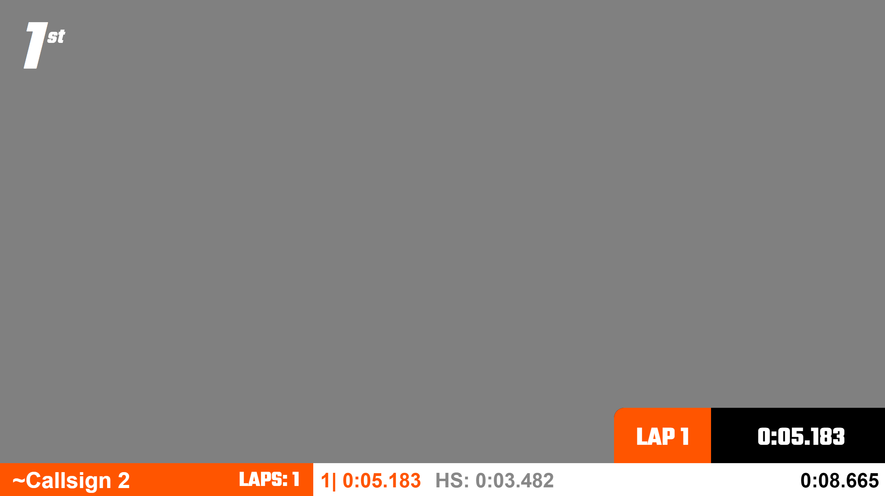

# Liga Colombiana Drone Racing

This overlay is designed by the <a href="https://ligacolombianadroneracing.com" target="_blank">Liga Colombiana Drone Racing</a> and consists of a top bar and a node overlay.

## Topbar

The title in the top bar consists of a heat name that changes dynamically and the organization name of LCDR (static).

URL to use:

```bash
RH-IP:5000/stream/overlay/lcdr/topbar
```


## Node

The node overlay shows the pilot name, lap time, total time and lap number. The color of the node changes based on what is set in RotorHazard for each pilot. Replace `[NUMBER]` with the node id you want to show.

URL to use:

```bash
RH-IP:5000/stream/overlay/lcdr/node/[NUMBER]
```

[](https://www.youtube.com/watch?v=i46IejMjN_Q)
_Click on the image to watch a video of the overlay in action_
