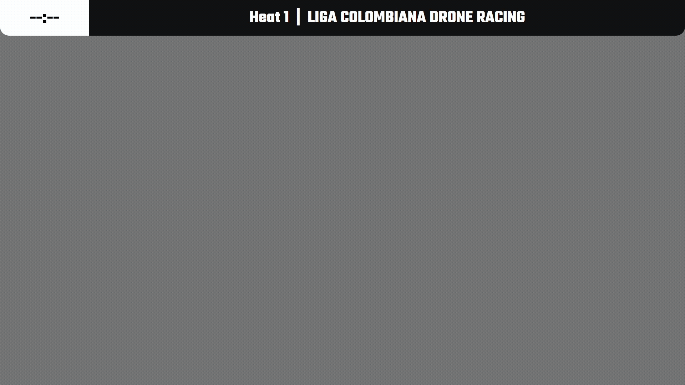
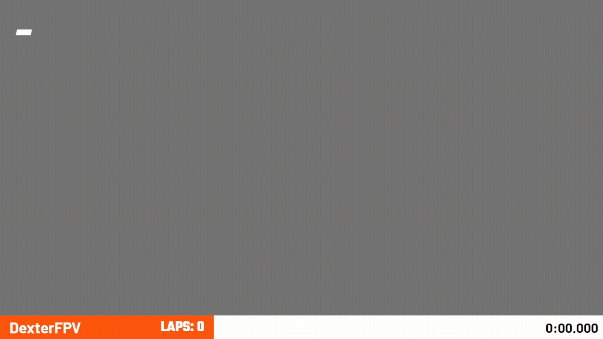

# Liga Colombiana Drone Racing

This theme is designed by the <a href="https://ligacolombianadroneracing.com" target="_blank">Liga Colombiana Drone Racing</a> and consists of a top bar and a node overlay.

## Theme highlights

- **League-branded palette**: Fonts, colors, and iconography are tailored to LCDR so the overlay matches slides, banners, and on-site visuals.
- **Dynamic timing**: Heat labels auto-update with RotorHazard, keeping the stream lower-third current without manual edits.
- **Pilot-first node**: Lap number, total, and per-lap timing stay readable thanks to the card layout and adaptive pilot colors.
- **Lightweight setup**: Only two overlay URLs are needed, allowing you to switch between Dutch Drone Squad and LCDR events without rebuilding your OBS scenes.

## Topbar

The title in the top bar consists of a heat name that changes dynamically and the organization name of LCDR (static). It is slightly taller than the DDS topbar to emphasize the LCDR crest.

URL to use:

```bash
RH-IP:5000/stream/overlay/lcdr/topbar
```



## Upcoming heat

Shows the current active heat with pilot lineup and channel assignments. Perfect for pre-heat announcements or during breaks between races.

- Displays heat name and event information
- Seat cards show pilot callsign and frequency/channel
- Automatically scales to fit 720p/1080p canvases
- Grid layout adapts based on seat count

URL to use:

```bash
RH-IP:5000/stream/overlay/lcdr/heat/upcoming
```


!!! note "Background transparency"
    The background visible in the preview GIF is not part of the overlay. You can configure your own background color or image in OBS to match your stream design.

## Node

The node overlay shows the pilot name, lap time, total time and lap number. The color of the node changes based on what is set in RotorHazard for each pilot. Replace `[NUMBER]` with the node id you want to show.

URL to use:

```bash
RH-IP:5000/stream/overlay/lcdr/node/[NUMBER]
```



## TrackDraw integration

LCDR can style the TrackDraw map and overview overlays. Pilot badges use the LCDR angular style with square corners and the pilot's team color.

### Live Race Map

Use the TrackDraw map when you want a dedicated track view or a compact map overlay styled with LCDR pilot badges.

```bash
RH-IP:5000/stream/overlay/lcdr/trackdraw/map
```

#### Query parameters

Use query parameters to adjust map-only behavior for compact OBS sources.

| Parameter | Values | Description |
|-----------|--------|-------------|
| `labels` | `0` | Hides pilot callsign badges when the map is used as a small corner source. |


!!! note "Preview performance"
    The live overlay runs much smoother in OBS or a browser than this GIF preview. GIF compression and frame-rate limits make the map movement look slower and less fluid.

### Overview

Use the TrackDraw overview for commentator scenes with a map, leader callout, and pilot list.

```bash
RH-IP:5000/stream/overlay/lcdr/trackdraw/overview
```

Use this as a full 16:9 browser source when you want the map, race status, current leader, and active pilot list in one scene.


See the [TrackDraw integration](../integrations/trackdraw/index.md) docs for setup, OBS settings, and production guidance.
